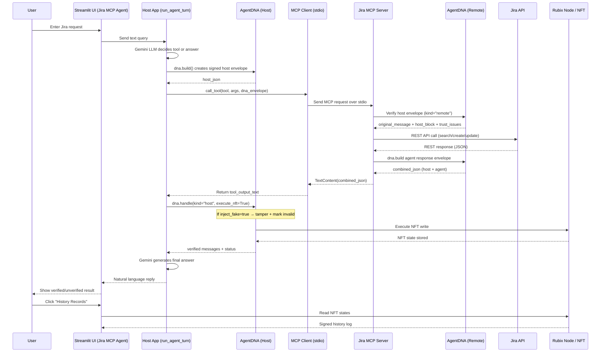

# Jira MCP Agent using AgentDNA 

This repository contains a fully integrated **Model Context Protocol (MCP)** server and client
designed to work with **Jira Cloud**, enhanced by **AgentDNA** for end‑to‑end trust and 
identity verification

## Features

- **Secure Jira automation** using MCP tools  
- **End‑to‑end signed messages** via AgentDNA  
- **Trust verification** on every server → client round‑trip  
- **Audit trail** for every Jira tool execution  
- **Streamlit‑based** UI with:
  - Conversation history  
  - One‑click history viewer   

## Components

### 1. MCP Server (`server.py`)
Provides Jira tools:

| Tool | Description |
|------|-------------|
| `search_issues` | JQL search via Jira v3 `/search/jql` |
| `get_issue` | Retrieve issue details |
| `create_issue` | Create a new issue (ADF description support) |
| `add_comment` | Add comment to issue |
| `transition_issue` | Move issue across workflow |

Each tool receives:
- `dna_envelope` (signed host message)
- Performs Jira call
- Returns **signed agent response** using AgentDNA

### 2. MCP Client / UI (`app.py`)
- Uses **Gemini 2.5 Flash** for natural language interpretation  
- Wraps tool calls inside **AgentDNA host envelopes**  
- Verifies server responses  
- Writes results to **Rubix NFT** for immutable logs 


## Environment Variables

```
GEMINI_API_KEY
AGENTDNA_API_KEY
JIRA_BASE_URL
JIRA_EMAIL
JIRA_API_TOKEN
```

## Running the UI

```bash
streamlit run app.py
```

The MCP server is automatically launched per request via Python stdio.

## Examples & Usage
Ask your AI assistant to:
- **Listing** Issues: list my open issues
- **Creating** a New Jira Issue: Create a new task in KAN.
Summary: Add login button
Description: Implement UI button for login
- **Adding a Comment** to an Issue: Add a comment to KAN-12 saying "Reviewed and approved"
- **Transitioning an Issue**: Move KAN-12 to In Progress

## Audit Viewer

The UI includes **History Records** which fetches all states  

### Sequence Diagram


## License
MIT License 

